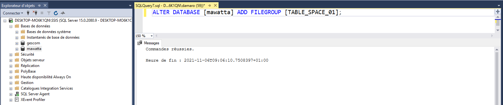
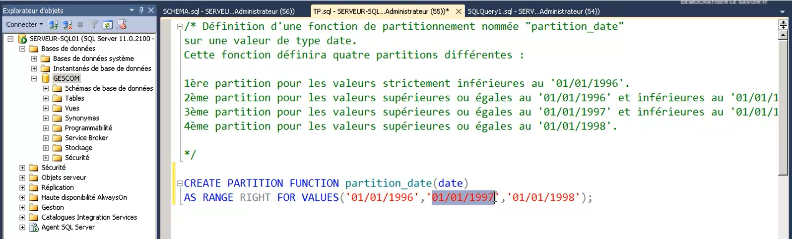
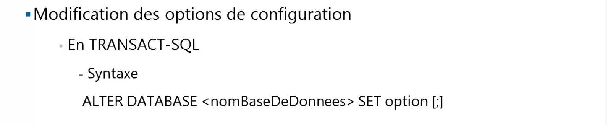
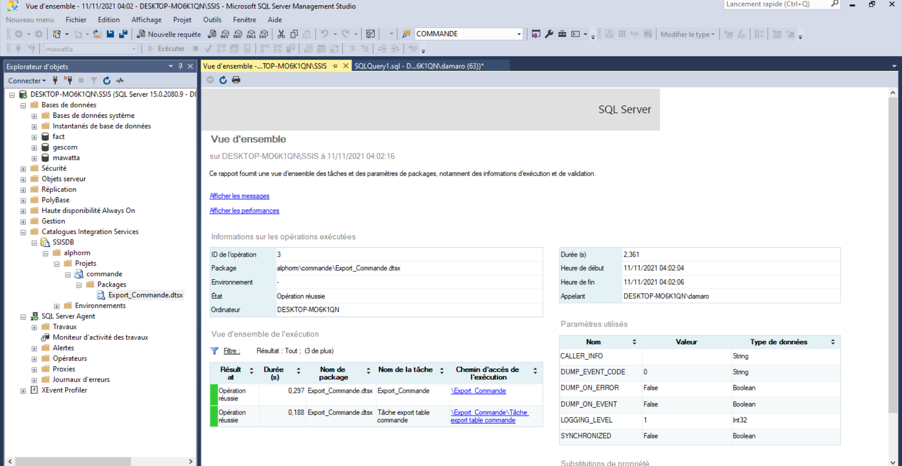
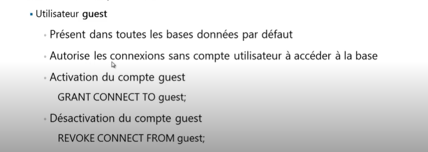

# SQL Serveur 2012
## Description de la formation
**SQL Server** est un système de gestion de base de données lancé par **Microsoft**. Il a pour fonction de stocker les données et de vérifier les contraintes d’intégrité définies.

Les administrateurs de données **SQL Server** sont en très forte demande partout dans le monde.

Votre **expert base de données**, Noureddine DRISSI, vous a préparé cette formation **SQL Server 2012 (70-462)** qui vous fournit les connaissances et les compétences nécessaires pour administrer et maintenir un environnement de base de données Microsoft SQL Server 2012 .

Pendant cette formation **SQL Server 2012 (70-462)**, Noureddine vous décompose les nombreuses facettes de bases de données sous SQL Server 2012 en partant des notions les plus basiques jusqu’aux secrets les plus profonds. Il vous dévoile aussi les bonnes pratiques à suivre pour éviter les erreurs classiques et optimiser votre déploiement.

Durant cette formation **SQL Server 2012 (70-462)**, vous apprendrez à installer et configurer SQL Server 2012, comment gérer une base de données sous **SQL Server 2012**. Vous apprendrez la sauvegarde, la restauration, l'importation, l'exportation, comment sécuriser les accès.

A l'issue de cette formation **SQL Server 2012**, vous serez capable de passer l'examen 70-462.

Noureddine fera de vous un excellent DBA et vous aidera à obtenir votre certification MCSA.

Durant des formations ultérieures, il vous accompagnera pour l'obtention des certifications MCSE : Data Platform et Business Intelligence.

## Objectifs
* Pouvoir installer et configurer SQL Server 2012,
* Pouvoir gérer les fichiers de base de données SQL Server 2012,
* Définir une stratégie de sauvegarde et de restauration des bases de données SQL Server 2012,
* Analyse et compréhension du SQL Server 2012,
* Transfert des données dans et à partir de SQL Server 2012,
* Pouvoir automatiser les tâches d’administration sous SQL Server 2012,
* Comprendre l’architecture de SQL Server 2012,
* Répliquer les données entre les instances SQL Server 2012.

## Prérequis
* Avoir suivi la formation Langage SQL est un plus,
* Connaissances de base du système d’exploitation Windows,
* Expérience professionnelle de Transact-SQL,
* Expérience professionnelle des bases de données relationnelles,
* Expérience en matière de conception de bases de données.

## Quelques commandes
* <code>USE gestion</code>: l'instruction **USE** permet de changer la base de travail

## SQLCMD

* pour afficher de l'aide <code>qslcmd -?</code>

* pour se connecter à l'instance par default
  * <code>hostname</code> celle-ci va afficher le nom de l'ordinateur sur le réseau puis on copie ce nom
  * <code> sqlcmd -E -S hostname</code>
  * Pour afficher la liste de toutes les bases de données <code>SELECT name FROM sys.databases;</code>
  
* Pour executer un script avec **SQLCMD**, <code>sqlcmd -E -S **nomdelinstance** -i **cheminduscript**</code>
* Pour utiliser une variable avec **SQLCMD** <code>sqlcmd -E -S DESKTOP-MO6K1QN\SSIS -i C:\Users\damaro\sql_serveur_2012\TP\variable.sql -v database="msdb"</code>

* Pour enregistrer la sortie dans un fichier et utiliser une variable avec **SQLCMD** <code>sqlcmd -E -S DESKTOP-MO6K1QN\SSIS -i C:\Users\damaro\sql_serveur_2012\TP\variable.sql -v database="msdb" -o C:\Users\damaro\sql_serveur_2012\output.txt</code>

## Modification des ressources
Nous pouvons modifier les valeurs soit avec **MSSM**, soit avec la procedure **sp_configure**
<pre>
<code>
USE master;
GO

EXEC sp_configure 'show advanced option', '1';
GO

EXEC sp_configure 'show advanced option';
GO

RECONFIGURE WITH OVERRIDE
GO
</code>
</pre>

## Configuration d'une base de données 

## Architecture d'une base de données

## Pour lire les fichier journaux

<code>SELECT * FROM ::fn_dblog(null, null)</code>

## Caractéristique des fichiers

## Structure des fichiers

## Une extension

## Types d'extension

* une **extension mixte**: est une extension qui peut contenir les données de plusieurs tables.
* une **extension uniforme ou spécialisée**: est  une extension qui ne contient que les données d'un seul object.

## Création d'une base de données

## En transact SQL

## Syntaxe complete

## Cas pratique

## Gestion d'une base de données

## Modification d'une base de données

## Changement d'un fichier logique

<pre>
<code>
ALTER DATABASE mawatta 
MODIFY FILE
(
	NAME=ma_mere,
	NEWNAME=mawatta01
)
</code>
</pre>

<pre>
<code>
ALTER DATABASE mawatta 
MODIFY FILE
(
	NAME=mawatta01,
	MAXSIZE=300MB,
	FILEGROWTH=0
)
</code>
</pre>

<pre>
<code>
ALTER DATABASE mawatta 
MODIFY FILE
(
	NAME=mawatta01,
	SIZE=16MB
)
</code>
</pre>

<pre>
<code>
ALTER DATABASE mawatta 
MODIFY FILE
(
	NAME=mawatta02,
	MAXSIZE=100MB
)
</code>
</pre>

<pre>
<code>
ALTER DATABASE mawatta 
MODIFY FILE
(
	NAME=mawatta_log01,
	SIZE=13MB
)
</code>
</pre>

<pre>
<code>
ALTER DATABASE mawatta 
ADD FILE
(
	NAME=mawatta03,
	FILENAME='c:\mawatta\data\mawatta03.ndf',
	SIZE=12MB,
	MAXSIZE=120MB,
	FILEGROWTH=5%
)
</code>
</pre>

<pre>
<code>
ALTER DATABASE mawatta 
ADD LOG FILE
(
	NAME=mawatta_log02,
	FILENAME='c:\mawatta\logs\mawatta_log02.ndf',
	SIZE=10MB,
	MAXSIZE=125MB,
	FILEGROWTH=10%
)
</code>
</pre>

## Libérer de l'espace disque inutilisé

## Shrink database

## Affichage du nom de la base courant

<code>SELECT db_name();</code>

## Affichage de l'ID de la base courant

<code>SELECT db_id();</code>

**NB**:
La taille compressée ne descend pas en dessous de la taille lors de la declaration.

## compresser la taille d'un fichier

## Groupe de fichier

## Utilisation des groupe de fichier

## Syntaxe de création d'un groupe de fichier

## Ajouter un fichier à un groupe de fichier

## Création de table dans un groupe de fichier(tablespace)

## Création d'index dans une table et groupe de fichier(tablespace)

## Le partitionnement

## Exemple

## Mise en oeuvre du partitionnement

## Comment ça marche la Fonction de partitionnement 

## Création de fonction de partitionnement

## Exemple

## Schema de partitionnement

## Création d'un schema de partitionnement

## Exemple transact-sql

## Création des objets de partition 

## Configurer une base de données

## Option de configuration

## Afficher les options de configuration

## Modification des options de configuration d'une base de données

## Les transactions 

## Syntaxe d'une transaction

## Les vérrous 

## La journalisation sous sql serveur 2012

## Le fonctionnement des fichiers journaux sous sql serveur 2012

## Les checkpoint 
c'est la durée à travers laquelle sql serveur ou tout serveur de base de donées synchronise synchrone les page de 8K dans fichiers data(.mdf, .ndf), mais on peut modifier le checkpoint par defaut à travers cette commande ci-dessous:

## Mode de récupération

## Mode de récupération: Simple

## Mode de récupération: Complet(recommandé)

## Mode de récupération: journalisé en bloc

## Compression des données

## Les clés et les certificats

## Certificats

## Hiérarchie de chiffrage

## Clé maître de service

## Clé maître de base de données

## Comment utilisé la maître de base de données

## Création de certificats

## Les clés asymetriques

## Les clés symetriques

## crypte un champs

 

 

## decrypte le champs

## Pourquoi sauvegarde

## Les caractéristique d'un sauvegarde

## Les methodes de sauvegarde

## Sauvegarde complète de la base de données

## Sauvegarde différentielle de la base de données

## Sauvegarde de journal de transaction de la base de données

## Sauvegarde partielle de la base de données

## Destination des sauvegardes

## Instruction BACKUP

## Caractéristique d'une sauvegarde différentielle

## Syntaxe de la sauvegarde différentielle

## Sauvegarde du journale des transactions

## Syntaxe de la Sauvegarde du journale des transactions

## Sauvegarde de groupe de fichiers

## Syntaxe de la Sauvegarde de groupe de fichiers

## Sauvegarde partielle

## Syntaxe d'une sauvegarde partielle

## Prérequis des sauvegarde

## Prérequis des sauvegarde 2

## Type de restauration

## Option de la commande RESTORE

## Capture instantannée de base de données

## Comment ça fonctionne

## Comment créer un snapshot 

## Architecture de transfère

## Les outils de transfert

## SSIS

## Architecture SSIS

## Flux de données

## Utilisation de SSIS

## ETL
### Création du fractionnement Conditionnelle

## Un package SSIS

## Déploiement du package

## BCP

## BULK INSERT

## Commande BULK INSERT

## Authentification SLQ Serveur

## Architecture de sécurité

## Mode d'authentification

## Entités de sécurités

## Configuré les entités de sécurité

## Entités de sécurités - vues systèmes

## Modifiés les entités de sécurités

## Les credentials

## Comment créer un credentials

## Les utilisateur de base de données

## Les utilisateur particuliers

##

## Comment créer un utilisateur de base de données

## Afficher les information sur les utilisateurs

## Schema

## Comment créer un schema

## Les droits d'accès sous SQL Serveur

## Gestion des privilèges

## La liste de quelques privilèges

## Syntaxe

## Privilèges sur les objets  

## Agent SQL Serveur

## Configuration du  service de messagerie

## Les opérateurs

## Les alertes

## Quand déclencher une alerte

## Création d'une alerte

## Les travaux 

## Plan de maintenance

## Audit au niveau de SQL Serveur

## Audit au niveau d'une base de données

## SQL Profiler

## Déclencheur DDL

